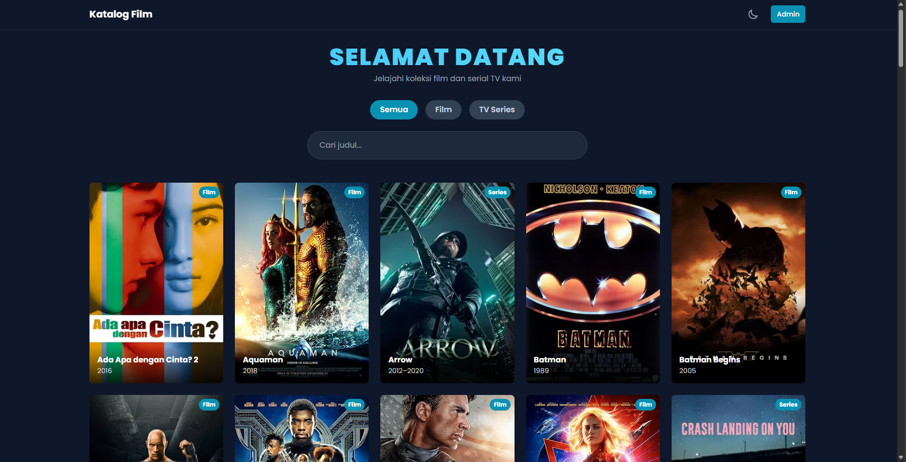

# 🎬 Katalog Film - Frontend

Ini adalah bagian **Frontend** dari aplikasi **Katalog Film**, dibangun menggunakan **Vue.js** dan di-styling dengan **Tailwind CSS**. Aplikasi ini menampilkan daftar film dan serial TV, halaman detail, serta dasbor admin yang aman untuk mengelola konten.

## ✨ Fitur Utama

- **Tampilan Responsif** - Didesain untuk bekerja dengan baik di desktop, tablet, dan mobile
- **Mode Terang & Gelap** - Tema dapat diganti sesuai preferensi pengguna, dengan state yang tersimpan di browser (localStorage)
- **Pencarian Real-time** - Cari konten secara dinamis tanpa perlu me-refresh halaman
- **Filter Kategori** - Filter untuk menampilkan Film atau TV Series
- **Halaman Detail** - Menampilkan detail lengkap film/series seperti poster, sinopsis, dan trailer YouTube yang disematkan
- **Dasbor Admin Aman** - Halaman khusus admin dengan proteksi JWT dan fitur CRUD (Create, Read, Update, Delete)
- **Manajemen State** - Menggunakan Pinia untuk manajemen status login admin dan data lainnya

## 🚀 Teknologi yang Digunakan

- **Vue 3** (Composition API)
- **Vite** sebagai build tool
- **Vue Router** untuk navigasi halaman
- **Pinia** untuk state management
- **Tailwind CSS** untuk styling
- **Axios** untuk permintaan API

<p align="center">
  
</p>

## 📂 Struktur Direktori

```
frontend-vue/
├── public/               # Aset statis yang tidak diproses
├── src/                  # Folder utama kode sumber
│   ├── assets/           # File CSS, gambar, font
│   ├── components/       # Komponen Vue yang dapat digunakan kembali (Navbar, MovieCard)
│   ├── router/           # Konfigurasi routing (halaman)
│   ├── stores/           # State management (Pinia)
│   ├── views/            # Komponen yang mewakili halaman penuh (Home, Admin, Detail)
│   ├── App.vue           # Komponen root aplikasi
│   └── main.js           # Titik masuk utama aplikasi
├── index.html            # File HTML utama
├── package.json          # Informasi proyek dan dependensi
└── vite.config.js        # Konfigurasi Vite
```

## 🛠️ Setup Lokal

### Prasyarat

Pastikan Anda sudah menginstal **Node.js** (versi 18 atau lebih tinggi direkomendasikan).

### Langkah-langkah Instalasi

#### 1. Clone Repositori

Buka terminal Anda dan jalankan perintah berikut:

```bash
git clone https://github.com/NAMA_ANDA/NAMA_REPO_FRONTEND.git
cd NAMA_REPO_FRONTEND
```

#### 2. Instal Dependensi

Instal semua paket yang dibutuhkan oleh proyek:

```bash
npm install
```

#### 3. Hubungkan ke Backend

Pastikan salah satu backend (MongoDB atau MySQL) sudah berjalan. Kemudian, buka file `src/stores/auth.js` dan pastikan variabel `API_URL` menunjuk ke alamat backend Anda yang benar.

```javascript
// src/stores/auth.js
const API_URL = 'http://localhost:3000/api'; // Ganti port jika perlu (misal: 3001 untuk MySQL)
```

#### 4. Jalankan Server Pengembangan

Jalankan server Vite:

```bash
npm run dev
```

Aplikasi akan tersedia di `http://localhost:5173` (atau port lain yang ditampilkan di terminal).

## 📝 Catatan Pengembangan

- Pastikan backend sudah berjalan sebelum menjalankan frontend
- Untuk mode produksi, gunakan `npm run build` untuk membuat build optimized
- File konfigurasi lingkungan dapat disesuaikan melalui variabel environment

## 🤝 Kontribusi

Silakan buat pull request atau buka issue jika Anda menemukan bug atau ingin menambahkan fitur baru.

## 📄 Lisensi

Proyek ini menggunakan lisensi MIT.